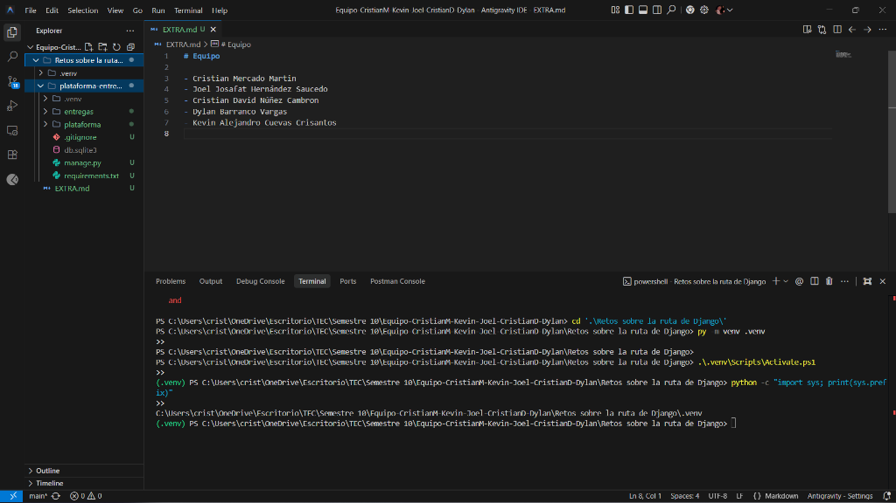
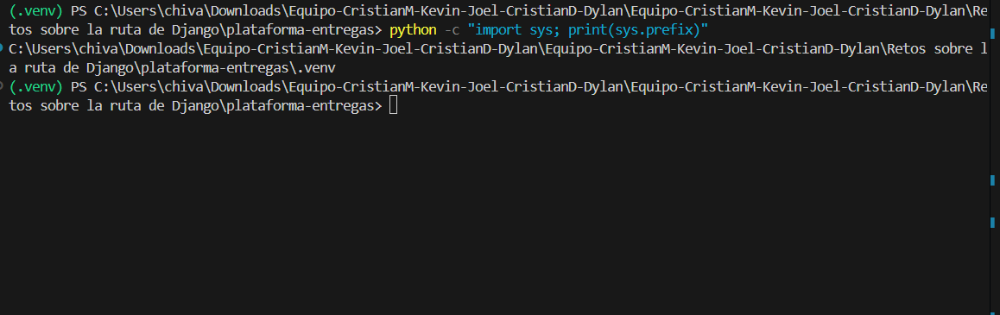
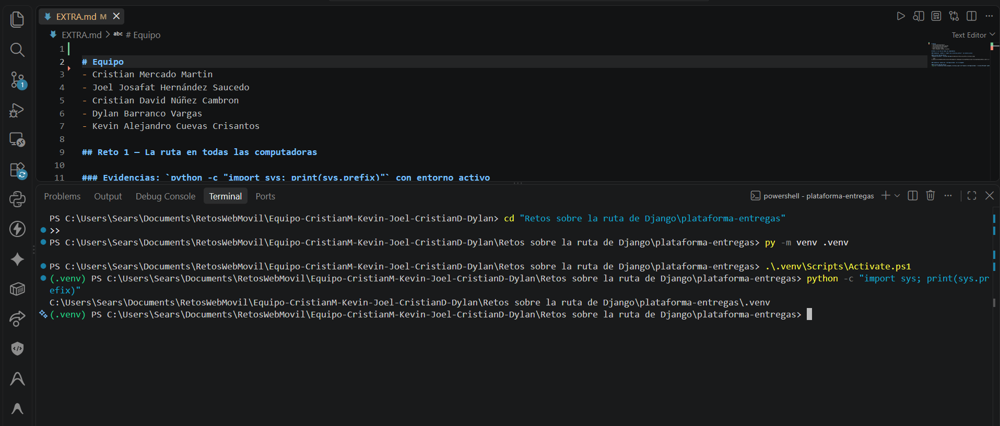
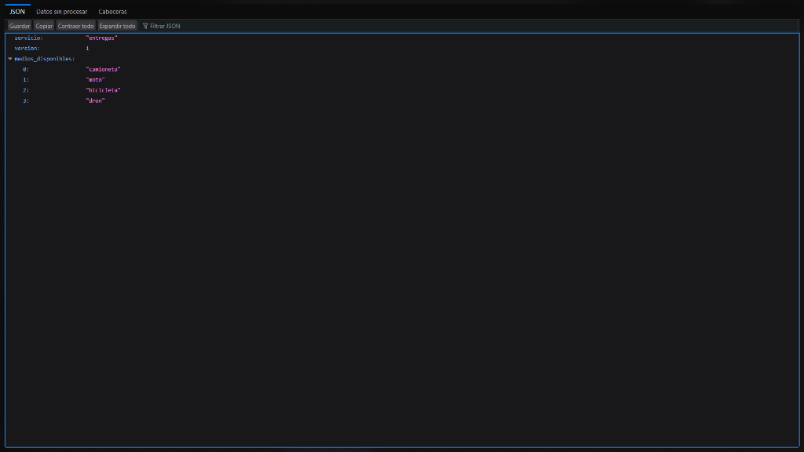
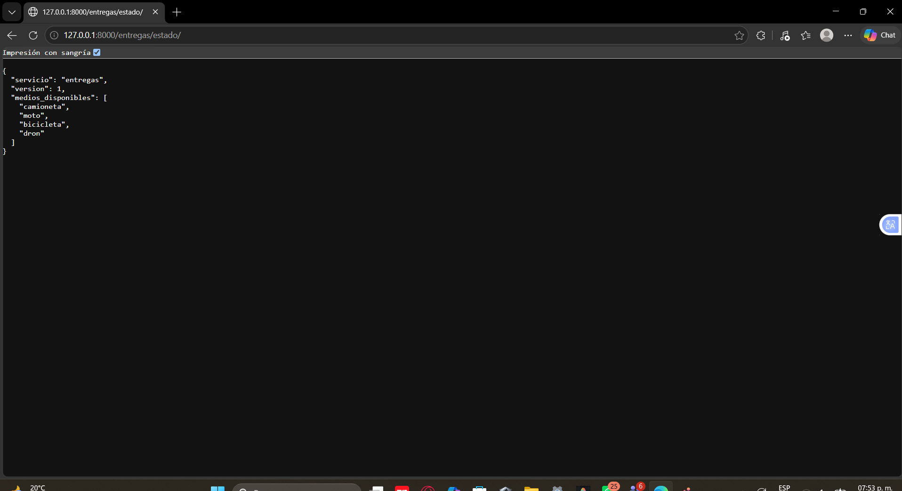
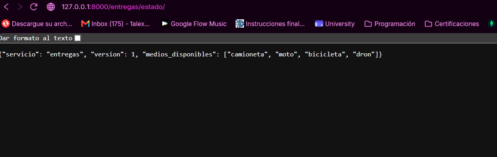

# Equipo

- Cristian Mercado Martin
- Joel Josafat Hernández Saucedo
- Cristian David Núñez Cambron
- Dylan Barranco Vargas
- Kevin Alejandro Cuevas Crisantos

## Reto 1 — La ruta en todas las computadoras

### Evidencias: `python -c "import sys; print(sys.prefix)"` con entorno activo

#### Cristian Mercado Martin



```text
C:\Users\crist\OneDrive\Escritorio\TEC\Semestre 10\Equipo-CristianM-Kevin-Joel-CristianD-Dylan\Retos sobre la ruta de Django\.venv
```
#### Cristian David Núñez Cambron


```text
C:\Users\chiva\Downloads\Equipo-CristianM-Kevin-Joel-CristianD-Dylan\Equipo-CristianM-Kevin-Joel-CristianD-Dylan\Retos sobre la ruta de Django\plataforma-entregas\.venv
```

#### Kevin Alejandro Cuevas Crisantos


```text
C:\Users\Sears\Documents\RetosAlcaraz\Equipo-CristianM-Kevin-Joel-CristianD-Dylan\Retos sobre la ruta de Django\plataforma-entregas\.venv
```

### Evidencias: Captura de `/entregas/estado/` en el navegador

#### Cristian Mercado Martin


#### Cristian David Núñez Cambron


#### Kevin Alejandro Cuevas Crisantos


