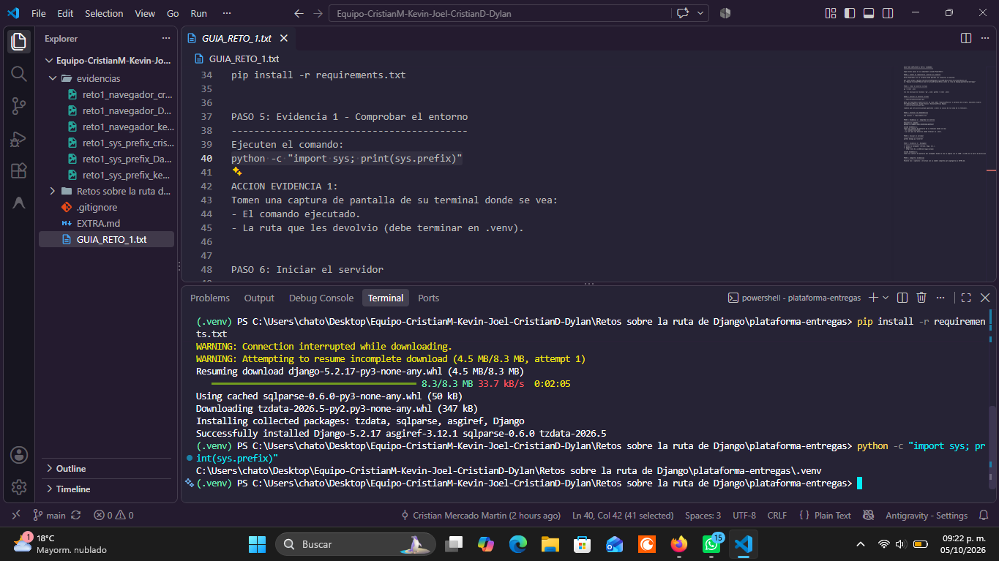
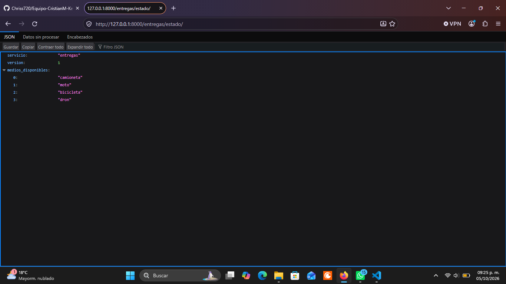

# Equipo

- Cristian Mercado Martin
- Joel Josafat Hernández Saucedo
- Cristian David Núñez Cambron
- Dylan Barranco Vargas
- Kevin Alejandro Cuevas Crisantos

## Reto 1 — La ruta en todas las computadoras

### Evidencias: `python -c "import sys; print(sys.prefix)"` con entorno activo

#### Cristian Mercado Martin


```text
C:\Users\crist\OneDrive\Escritorio\TEC\Semestre 10\Equipo-CristianM-Kevin-Joel-CristianD-Dylan\Retos sobre la ruta de Django\.venv
```

#### Cristian David Núñez Cambron


```text
C:\Users\chiva\Downloads\Equipo-CristianM-Kevin-Joel-CristianD-Dylan\Equipo-CristianM-Kevin-Joel-CristianD-Dylan\Retos sobre la ruta de Django\plataforma-entregas\.venv
```

#### Kevin Alejandro Cuevas Crisantos


```text
C:\Users\Sears\Documents\RetosAlcaraz\Equipo-CristianM-Kevin-Joel-CristianD-Dylan\Retos sobre la ruta de Django\plataforma-entregas\.venv
```

#### Dylan Barranco Vargas


```text
C:\Users\chato\Desktop\Equipo-CristianM-Kevin-Joel-CristianD-Dylan\Retos sobre la ruta de Django\plataforma-entregas\.venv
```

### Evidencias: Captura de `/entregas/estado/` en el navegador

#### Cristian Mercado Martin


#### Cristian David Núñez Cambron


#### Kevin Alejandro Cuevas Crisantos


#### Dylan Barranco Vargas


---

## Reto 2 — Una cotización que entrega datos (2 puntos)

### 1. Código de `entregas/reglas.py`
Separación de la lógica de negocio fuera de la vista:

```python
def elegir_medio(km, kg):
    """
    Decide el medio de entrega basado en la distancia (km) y el peso (kg).
    """
    if kg > 20:
        return {"medio": "camioneta", "motivo": "paquete pesado (más de 20 kg)"}
    elif km <= 3 and kg <= 5:
        return {"medio": "dron", "motivo": "distancia muy corta y paquete muy ligero"}
    elif km <= 10 and kg <= 10:
        return {"medio": "bicicleta", "motivo": "distancia y peso adecuados para bicicleta"}
    else:
        return {"medio": "moto", "motivo": "distancia media o paquete que no cabe en bici"}
```

### 2. Código de la vista en `entregas/views.py`
Lectura, validación de parámetros (errores con código HTTP 400) y delegación a la regla de negocio:

```python
def cotizar(request):
    # 1. Leer los datos de la petición (que llegan como texto)
    km_str = request.GET.get("km")
    kg_str = request.GET.get("kg")

    # 2. Validar que no falten y que sean números positivos
    if km_str is None or kg_str is None:
        return JsonResponse({"error": "Faltan los parámetros 'km' y/o 'kg'"}, status=400)

    try:
        km = float(km_str)
        kg = float(kg_str)
        if km < 0 or kg < 0:
            raise ValueError
    except ValueError:
        return JsonResponse({"error": "Los parámetros deben ser números positivos válidos"}, status=400)

    # 3. Llamar a la regla de negocio
    resultado = elegir_medio(km, kg)

    # 4. Devolver la respuesta en JSON
    return JsonResponse({
        "km": km,
        "kg": kg,
        "medio": resultado["medio"],
        "motivo": resultado["motivo"]
    })
```

### 3. Salida de las tres pruebas

#### Prueba 1: Petición correcta (`/entregas/cotizar/?km=5&kg=2`)
- **Petición:** `GET http://127.0.0.1:8000/entregas/cotizar/?km=5&kg=2`
- **Código HTTP:** `200 OK`
- **Respuesta JSON:**
```json
{
  "km": 5.0,
  "kg": 2.0,
  "medio": "bicicleta",
  "motivo": "distancia y peso adecuados para bicicleta"
}
```

#### Prueba 2: Petición con parámetro faltante (`/entregas/cotizar/?kg=2`)
- **Petición:** `GET http://127.0.0.1:8000/entregas/cotizar/?kg=2`
- **Código HTTP:** `400 Bad Request`
- **Respuesta JSON:**
```json
{
  "error": "Faltan los parámetros 'km' y/o 'kg'"
}
```

#### Prueba 3: Petición con dato inválido (`/entregas/cotizar/?km=abc&kg=2`)
- **Petición:** `GET http://127.0.0.1:8000/entregas/cotizar/?km=abc&kg=2`
- **Código HTTP:** `400 Bad Request`
- **Respuesta JSON:**
```json
{
  "error": "Los parámetros deben ser números positivos válidos"
}
```

### 4. Preguntas teóricas

#### 1. ¿Por qué la validación tiene que estar en el backend, aunque la app móvil ya revise que el campo no esté vacío?
Porque el cliente nunca es confiable. Cualquier usuario o atacante puede saltarse la validación de la interfaz gráfica (la app móvil o el formulario web) realizando peticiones HTTP directas mediante herramientas como `curl`, Postman, scripts externos o versiones desactualizadas de la aplicación. Si el backend no valida de forma estricta los tipos de datos, rangos y campos requeridos, el sistema queda vulnerable a excepciones no controladas (errores 500), corrupción de datos o inyecciones maliciosas.

#### 2. Su función probablemente tiene una cadena de `if`. ¿Qué patrón de los apuntes la reemplazaría cuando haya que agregar el dron o un quinto medio, y qué ganarían con eso?
El patrón **Strategy** (o una combinación con **Chain of Responsibility** / **Factory Method**).
Con el patrón **Strategy**, cada medio de transporte encapsula sus propias condiciones de idoneidad, costos y límites en clases separadas (`EstrategiaBicicleta`, `EstrategiaMoto`, `EstrategiaCamioneta`, `EstrategiaDron`) que implementan una interfaz común. 
**Qué se gana:** Se cumple el principio *Open/Closed* (abierto a extensión, cerrado a modificación). Para incorporar un quinto o sexto medio (como barco o tren), no se modifica una cadena frágil de `if/elif` con riesgo de romper la lógica existente, sino que simplemente se crea una nueva clase de estrategia y se registra en el catálogo sin alterar el resto del código.
